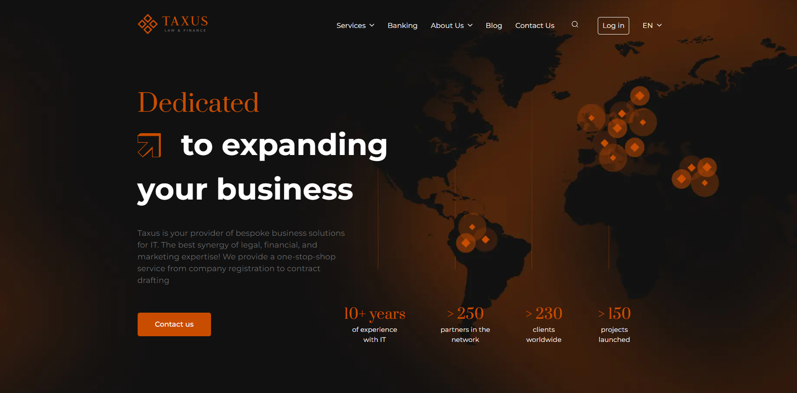

<h1>Website "Taxus"</h1>
<h2>About</h2>
<ul>
  <li>Site name: "Taxus";</li>
  <li>Web developer: Andriy Ovcharov;</li>
  <li>Development date: 22.01.2025;</li>
  <li>
    
Brief description:

    
The website represents a company specializing in a wide range of business registration services. 
      It is built based on a Figma design, using HTML, CSS, and JavaScript for a clean and responsive layout.

  </li>
  <li>View source files: https://github.com/ovcharovcoder/taxus-project-src</li>
  <li>View website: https://ovcharovcoder.github.io/taxus-website</li>
</ul>

